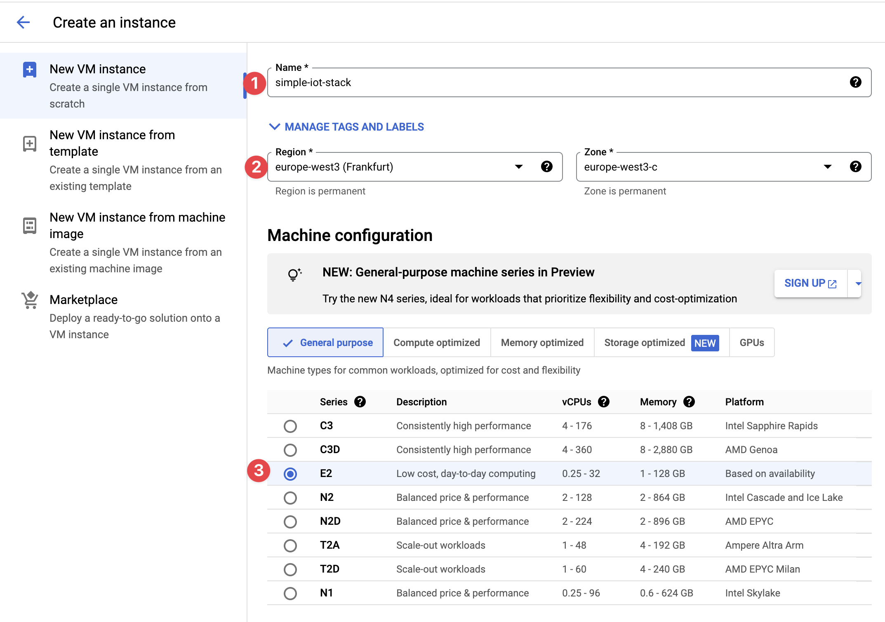
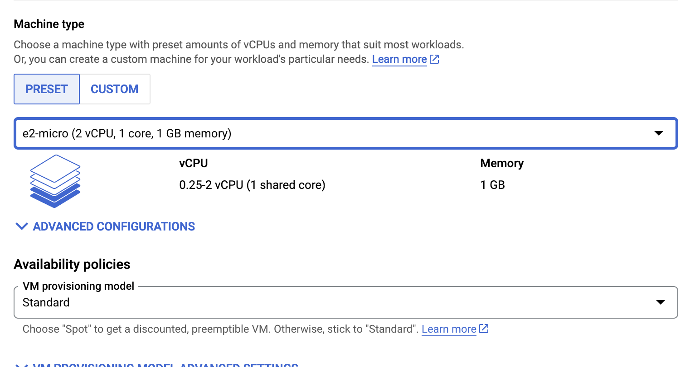
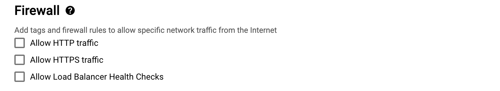
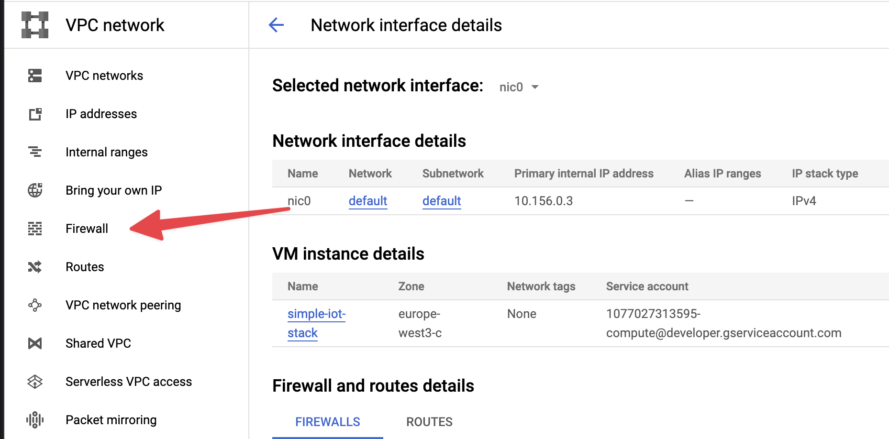
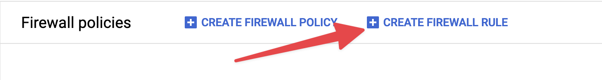

# Deploy to Google cloud

This document describes how the IoT stack can be
deployed in the free tier of the Google cloud.

1. To redeem the educational credits for Google cloud follow the
   steps described in this [document](https://cloud.google.com/billing/docs/how-to/edu-grants#redeem).
1. To create a new instance open the
   [Google Cloud Console](https://console.cloud.google.com/) and click the
   _Create a VM_ button.

   1. On the _Create a instance_ page provide a name for the instance.
      In the screenshot the name `simple-iot-stack` is used.
      
   1. As _Region_ select a region close to your location. In the
      screenshot the region `europe-west3` is selected.
   1. In the _Machine configuration: select the \_E2_ series.
   1. As the _Machine type_ select _e2-micro_.
      
   1. Scroll down to the _Firewall_ section. Activate
      the access via HTTP and HTTPS.
      
   1. Finally click on _Create_ to create the instance. Creating the VM will
      take a few moments. Once the VM is up and running a green icon is shown
      in the _VM instances_ list.

1. To enable the connection to the MQTT broker of the IoT stack,
   one additional firewall
   rule needs to be added to the virtual network of the VM.

   1. To add these
      click on the VM to view its details.
   1. Scroll down to the network interfaces section and click on the
      name of the created network. This opens the _VPC network_ view.
   1. In the navigation pane click on _Firewall_.
      
   1. In the next screen click on _CREATE FIREWALL RULES_ to add a new rule.
      
   1. Name the rule _allow-mqtt_ and change the following settings:
      - Change the _Targets_ to _All instances in the network_.
      - Set the _Source IPv4 ranges_ to 0.0.0.0/0.
      - Set the _Allowed protocols_ to _TCP_ and the port to _1883_.
   1. Click on _Create_ to create the rule.

1. To enable connecting to the VM using a domain name a dynamic DNS service can
   be used. For example, [DuckDNS](https://duckdns.org) can be used to map a subdomain
   like `my-simple-iot` to the IP address of the VM. In this example the VM is
   would now be accessible at `http://my-simple-iot.duckdns.org`. However,
   no services are running on the VM yet.
   

1. The next step is to connect to the VM and install the required software.

   1. The easiest way to connect to the VM instances on the
      Google cloud platform is to use the browser based SSH shell. To access this
      SSH shell click on the _SSH_ link in the list of VMs and select
      _Open in browser window_.

   1. To update the software to the latest version first run the following
      commands. Then first command fetches the latest package versions from
      the central repository and the second command updates the installed
      packages.

      ```zsh
      sudo apt-get update
      sudo apt-get upgrade
      ```

   1. Finally, the required packages (i.e. Docker, Docker-Compose, git and some editor)
      can be installed:

      ```zsh
      sudo apt-get install docker docker-compose git neovim nano
      ```

After the required software is installed, the IoT stack can be deployed as
described in the [Quickstart](../README.md#quickstart) section.
Once the IoT stack is up and running the service can be accessed
via the domain name. In this
example the InfluxDB would be available via the
URL `https://influxdb.my-simple-iot.duckdns.org`.
