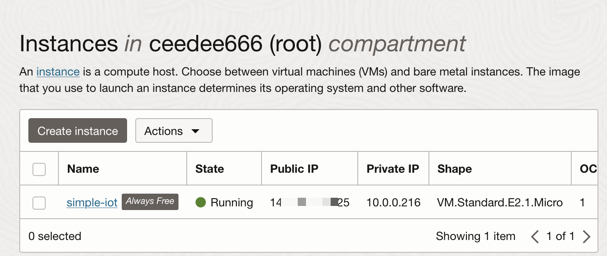

# Deploy to Oracle cloud

This document describes how the IoT stack can be
deployed in the free tier of the Oracle cloud.

1. To create a new instance navigate to _Compute → Instances_ and
   click on _Create Instance_.
   1. On the _Create Compute Instance_ page provide a name for the instance.
      In the screenshot the name `simple-iot-stack` is used.
      
   1. Scroll down to the _Image and Shape_ area and click on _Edit_.
      
      The area expands to show more details. Click on _Change Image_
      and select the latest available Ubuntu image. Make sure to select
      the _Minimal_ version. This will create the smallest possible VM.
      
   1. Scroll down to the _Add SSH Keys_ section. Click on _Save private key_.
      This key is required to connect to the VM via SSH.
      
   1. Finally click on _Create_ to create the instance. Creating the VM will
      take a few moments. Once the VM is up and running a green icon is shown
      in the instances list.
      
1. To enable the connection to the services of the IoT stack, a few firewall
   rules need to be added to the virtual network of the VM.

   1. To add these
      click on the VM to view its details. In the _Instance Details_ section
      click on the _Virtual cloud network_ link.
   1. Click on the subnet link of the virtual cloud network.
   1. Click on the default security list of the virtual cloud network.
   1. Add three _Ingress Rules_ to allow connections from anywhere
      (`0.0.0.0/0`) to the ports 80, 444, and 1883 using the
      _Add Ingress Rule_ button. The resulting rules are shown in the following
      screenshot.
      

1. To enable connecting to the VM using a domain name a dynamic DNS service can
   be used. For example, [DuckDNS](https://duckdns.org) can be used to map a subdomain
   like `my-simple-iot` to the IP address of the VM. In this example the VM is
   would now be accessable at `http://my-simple-iot.duckdns.org`. However,
   no services are running on the VM yet.
   

1. The next step is to connect to the VM and install the required software.

   1. To enable a SSH connection to the VM, first change the access rights
      for the SSH key. The SSH key should only be accessible by the user
      running the SSH connection. To do this using the terminal use the
      following command:

      ```zsh
      chmod 400 <path-to-ssh-key>
      ```

   1. After that you can connect to the VM via SSH using the following command:

      ```zsh
      ssh -i <path-to-ssh-key> ubuntu@<domain-name>
      ```

   1. To update the software to the latest version first run the following
      commands. Then first command fetches the latest package versions from
      the central repository and the second command updates the installed
      packages.

      ```zsh
      sudo apt-get update
      sudo apt-get upgrade
      ```

   1. Finally, the required packages (i.e. Docker, Docker-Compose, git and some editor)
      can be installed:

      ```zsh
      sudo apt-get install docker docker-compose git neovim nano
      ```

After the required software is installed, the IoT stack can be deployed as
described in the [Quickstart](../README.md#quickstart) section.
Once the IoT stack is up and running the service can be accessed
via the domain name. In this
example the InfluxDB would be available via the
URL `https://influxdb.my-simple-iot.duckdns.org`.
